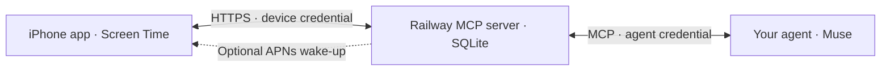

# Gatekeeper

**Your agent holds the keys.**

[](https://railway.com/deploy/A-K_7u)

Most app blockers let you override the block at exactly the moment you want to
scroll. Gatekeeper puts a conversation in that gap: tell your agent what you need
to do and when you will stop. The agent decides whether to issue a short access
pass. Your iPhone enforces the timer.

A native SwiftUI app, a small self-hosted MCP server, and the agent you already
use. No language model runs inside Gatekeeper. The UI calls the agent **Muse**;
any client supporting Streamable HTTP MCP and bearer authentication can connect.

## How it works



1. Choose the apps, categories, and websites to shield on your iPhone.
2. Ask your agent for access, with a concrete task and an exit plan.
3. The agent checks status and, if appropriate, issues a single-use pass.
4. The phone redeems the pass within **5 minutes** and schedules a local relock
   before opening the selection for **16 minutes**.
5. A **30-minute cooldown** follows the window. Ending early does not reset it.

The agent can approve or request an early end. It cannot extend the timer or
reset cooldown through the MCP tools. Approval, phone redemption, and confirmed
access are separate states. The agent must check a fresh phone report before
claiming access started.

## Get started

You need Node.js **24.4+**, a Mac with Xcode and an iOS 17+ device for the app,
a developer team able to provision Family Controls and App Groups, and an MCP
client with custom bearer-header support. This is a **single-user, single-phone
prototype**; physical-device enforcement and push delivery need your own
acceptance testing.

### 1. Run the server locally

```sh
git clone https://github.com/nmcnamee24/Gatekeeper.git
cd Gatekeeper/connector
npm ci
npm test
npm run init
npm start
```

`init` writes a private `.env` with two independently generated credentials and
refuses to overwrite an existing file. It does not print secrets. See
[the configuration reference](connector/.env.example) for every setting.

In a second terminal:

```sh
curl --fail http://127.0.0.1:8787/health
# From the connector directory, discover tools and read status:
node --env-file=.env scripts/check-service.js
```

The second check authenticates using the agent credential without issuing an
approval. Local HTTP is for development. The iPhone requires a public HTTPS
origin; its `localhost` is not your Mac.

### 2. Deploy on Railway

See [Railway deployment](docs/railway.md) for persistent storage, variables,
health checks, and deployment verification. Use one replica and preserve the
SQLite volume across deployments. The deploy button creates a service with a
persistent volume and independently generated credentials. Review Railway's
cost estimate before starting it; optional APNs still needs your Apple key.

### 3. Build the iPhone app

1. Open `Gatekeeper.xcodeproj` in Xcode. Select your developer team for **both**
   `Gatekeeper` and `GatekeeperMonitor`.
2. Give both targets unique bundle IDs. Enable Family Controls and the same App
   Group in both. Change `group.com.noah.gatekeeper` in **both entitlement files**
   and `Shared/Protection.swift` together. The included identifiers are examples,
   not credentials or provisioned identifiers for your account.
3. For repeatable project generation, make the same signing and identifier
   changes in `project.yml`, then run `xcodegen generate` if you use XcodeGen.
4. Connect your iPhone, enable Developer Mode, and run the `Gatekeeper` scheme.
5. Authorize Screen Time and choose your selection. Leave Phone and Messages
   outside the selection. Gatekeeper opens the whole selection, not one app.
6. Open connection settings and enter your HTTPS origin (no `/mcp`) and the
   **DEVICE_TOKEN**. The app verifies it before storing it in Keychain.

Family Controls distribution requires Apple's approval. Read Apple's
[entitlement instructions](https://developer.apple.com/documentation/familycontrols/requesting-the-family-controls-entitlement)
when preparing TestFlight or App Store distribution.

### 4. Connect your agent

Configure a Streamable HTTP MCP connection:

- URL: `https://YOUR-SERVICE/mcp`
- Authorization header: `Bearer <MUSE_TOKEN>`

Enter the real key only in your client's secure credential configuration.
`MUSE_TOKEN` is the agent's credential; **never give it DEVICE_TOKEN**. There is
no OAuth login or legacy SSE endpoint. A client that requires either needs an
adapter.

Ask the client to discover tools and load the `gatekeeper-role` prompt or
`gatekeeper://policy` resource. [Agent setup](docs/agent-setup.md) explains the
behavioral contract. Start by calling `gatekeeper_status`.

### Optional background notifications

Set `APNS_KEY_ID`, `APNS_TEAM_ID`, `APNS_PRIVATE_KEY`, and `APNS_TOPIC` on the
server. The topic must match your app's bundle ID. Never bundle an APNs private
key in the app. Open the app to register the device and enable approval
notifications in its settings. Debug builds register with the sandbox;
Release builds use production, so signing entitlements must match.

The server queues a silent wake-up, with an approval alert fallback. iOS may
delay background delivery, especially after force-quitting. Reopening the app
triggers sync. Push delivery is not evidence that the phone unlocked. Revocation
also requires the phone to sync; the local expiry schedule is the fallback.

## What “holds the keys” means

This is voluntary friction, not tamper-proof parental control. The owner can
revoke Screen Time permission, uninstall the app, or modify their server. Agent
judgment can be wrong. The fixed timing rules are enforced by code; judging your
reason belongs to the agent.

The server stores request purposes, exit plans, grant history, device reports,
and an APNs token when registered. It does not receive your Screen Time selection
tokens or chat history. There is no automatic retention policy. Keep purposes
nonsensitive and protect the volume. This prototype has no multi-user isolation,
OAuth, or application-level rate limiting.

## Development and verification

```sh
npm ci --prefix connector
npm test --prefix connector
swift test
swiftc Sources/GatePolicy/GatePolicy.swift scripts/VerifyPolicy.swift -o /tmp/gatekeeper-policy-check
/tmp/gatekeeper-policy-check
swiftc -swift-version 5 Sources/GatePolicy/GatePolicy.swift App/ConnectorClient.swift scripts/VerifyConnector.swift -o /tmp/gatekeeper-connector-check
/tmp/gatekeeper-connector-check
xcodebuild -project Gatekeeper.xcodeproj -scheme Gatekeeper -sdk iphonesimulator -destination 'generic/platform=iOS Simulator' CODE_SIGNING_ALLOWED=NO build
```

The tests cover MCP discovery, separated credentials, pass expiry and replay,
concurrent redemption, cooldown persistence, revocation, and the push outbox.
An unsigned build or simulator launch does not verify Screen Time enforcement.
Use [the device checklist](docs/device-testing.md) before relying on the app.

| Path | Responsibility |
| --- | --- |
| `App/` | SwiftUI interface, Keychain pairing, device API, background sync |
| `Monitor/` | Device Activity extension for relocking |
| `Shared/` | Screen Time shields, shared state, access schedule |
| `Sources/GatePolicy/` | Phone timing policy |
| `connector/src/` | MCP tools, device API, SQLite, optional APNs |
| `connector/test/`, `Tests/`, `scripts/` | Automated verification |

## Contributing

Small, focused pull requests are welcome. Run the checks relevant to your change.
Describe device observations separately from automated test results. Never commit
credentials, local databases, signing keys, or personal deployment records.
See [SECURITY.md](SECURITY.md) for credential handling and reporting.

## License

[MIT](LICENSE).
